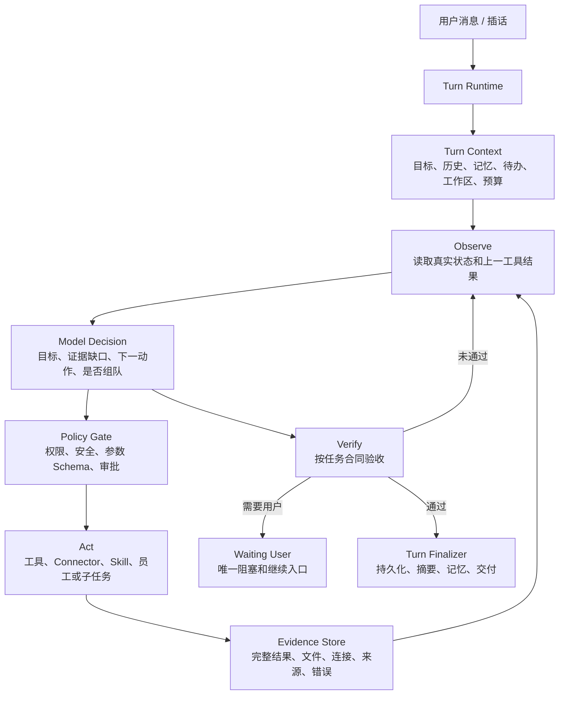

# 太极 v1.0.2 与 Hermes Agent 源码级差距审计

> 审计日期：2026-07-29  
> 太极基线：`4b4ee94c283bdea50f64db08bbd31cdd2d6e372e`（v1.0.2）  
> Hermes 基线：`41a07f5b8451f88a8b8b5adfc0cfdc2ada0a1f90`（2026-07-29）  
> 审计目标：解释为什么使用相近模型时，Hermes 更像自主智能体，而太极仍会机械、跑偏、重复和错误组队，并给出不推翻现有项目的升级路线。

> v2.0 落地状态：本报告保留为 v1.0.2 的源码差距快照。报告中的统一 Turn Runtime、每轮观察与决策、精确工具参数、类型化交付、能力图组队、MoA 顾问隔离、分类恢复、上下文证据压缩和轨迹门禁已在 `v2.0.0` 实现。当前实现与责任边界以 `docs/V2_RUNTIME_ARCHITECTURE.md` 为准；后续不得按本报告的旧“待实现”措辞重复造第二套内核。

## 1. 结论先行

太极当前的主要短板不是模型、人格或长期记忆，也不是缺少更多提示词，而是**执行控制权的划分不正确**。

Hermes 的关键闭环是：

```text
准备本轮上下文
  -> 模型读取目标和真实状态
  -> 模型选择下一步或工具
  -> 运行时校验权限并原样执行工具参数
  -> 完整工具结果回注同一会话
  -> 模型依据新证据重新判断
  -> 验证是否完成
  -> 统一持久化、收尾或交接
```

太极已经有任务合同、任务账本、Worker、记忆、诊断、Skill 健康、安全审批、恢复点和验收模块，但运行时仍存在三条不同执行链，并在模型决策之后加入大量主题规则。结果是：

1. 模型理解对了，程序可能仍会改写搜索词、强制 Skill 路线或强制写文件。
2. 模型只在任务开头编译一次结构化任务决策，后续虽然仍会继续调用模型，但“换什么路线、何时停、如何压缩上下文”主要受不同入口各自的规则控制。
3. 助理、员工私聊、正式团队和浏览器兼容团队看到的上下文、预算、工具结果与验收规则不完全一致。
4. 团队调度最终仍大量依赖关键词和正则评分，模型产生的能力描述没有变成稳定的能力 ID 和覆盖图。
5. 现有测试能证明模块存在、规则存在，却不足以证明一次真实任务轨迹最终选对工具、选对成员、搜对问题并在错误后换对路线。

因此，太极现在是“基础设施丰富，但认知闭环分裂”。继续追加场景正则，只会让局部测试变绿，不能从根本上提高自主性。

## 2. 审计范围

本次不是只看 Hermes 官网功能说明，而是固定到官方提交后核对其运行源码：

- 全仓根目录和源码树，确认真实入口、模块边界、工具系统、网关、测试和桌面端并存关系。
- `run_agent.py` 主入口及 `agent/` 下 168 个 Python 模块的结构和调用关系。
- 完整阅读与任务智能直接相关的核心文件：`conversation_loop.py`、`turn_context.py`、`turn_finalizer.py`、`turn_retry_state.py`、`iteration_budget.py`、`error_classifier.py`、`context_compressor.py`、`tool_executor.py`、`tool_result_classification.py`、`verification_stop.py`、`moa_loop.py`、`subagent_lifecycle.py`、`memory_manager.py`。
- 完整阅读关键工具侧文件：`registry.py`、`tool_search.py`、`delegate_tool.py`、`async_delegation.py`、`todo_tool.py`、`kanban_tools.py`、`checkpoint_manager.py`。
- 对照太极助理、员工私聊、正式团队、兼容团队、任务决策、成员匹配、上下文压缩、工具执行和验收代码。

没有必要照搬的 Hermes 桌面 UI、消息平台适配器、CLI 命令文案和供应商重复适配层，只核对其与核心循环的接线方式，不作为太极升级目标。

## 3. Hermes 为什么显得更聪明

### 3.1 一个主模型始终掌握语义决策

`run_agent.py` 的 `AIAgent.run_conversation()` 只负责把执行交给 `agent/conversation_loop.py::run_conversation()`。后者从一轮开始到结束维持同一条循环：初始化上下文、消费预算、调用模型、执行工具、回注结果、再次调用模型，最后统一收尾。

重要的不是它“调用了很多次模型”，而是每次调用都能看到上一动作的真实结果。工具失败、网页内容不相关、文件不存在或用户插话都会成为下一次模型判断的观察值。

### 3.2 硬规则主要保护边界，不替模型理解业务

Hermes 也有大量确定性代码，但主要处理：

- 认证、计费、限流、超时、TLS、模型不可用。
- 上下文溢出、输出截断、图片过大、供应商格式差异。
- 工具名和参数格式修复、权限、安全、中断和结果配对。
- 预算、资源清理、会话持久化和验证证据。

这些规则回答的是“这一步能否安全、正确地执行”，而不是直接回答“用户想查什么、应该拉谁、所有任务都必须产出文件吗”。语义选择仍留给模型。

### 3.3 每一轮都有独立生命周期

`TurnContext` 在首个模型请求前完成用户消息持久化、Todo 恢复、外部记忆预取和崩溃保护。`TurnFinalizer` 不论正常完成、预算耗尽、中断还是异常，都统一保存轨迹、会话、剩余插话、诊断和后台记忆复盘。

这避免了“正常路径有记忆，异常路径丢状态”“窗口关掉后不知道任务是否还在”“预算到头只停住不交接”等分叉。

### 3.4 恢复策略是分类的，而且每类恢复有限次

`ErrorClassifier` 把认证、计费、限流、超时、上下文溢出、载荷过大、格式错误、内容策略和模型不可用等情况分开。`TurnRetryState` 记录本轮已经尝试过的恢复方式，避免相同恢复动作反复执行。

因此，Hermes 不会把“没 API Key”“网页结果偏题”“上下文过长”和“工具参数格式错误”都当成同一种失败后机械重试。

### 3.5 工具执行保持调用与结果原子配对

模型产生的工具名和参数经过格式、权限与安全校验后执行。运行时会修复可确定的拼写或 JSON 问题，但不会把模型的精确搜索词替换成整段用户原话。混合工具批次中，坏调用被隔离，有效调用仍能继续；每个 `tool_call_id` 都有对应结果回注。

### 3.6 工具发现按需进行

Hermes 的 Tool Registry 是唯一工具事实源。工具较多时，Tool Search 只向模型暴露核心工具和搜索/描述桥接工具；模型先发现能力，再加载具体 Schema。这样既避免上下文被几百个工具定义占满，也避免代码里维护另一套会漂移的工具清单。

### 3.7 MoA 是“顾问 + 行动主模型”，不是多人依次发言

Hermes 的参考模型只提供私有建议，不能声称调用工具或完成任务。聚合结果作为指导交给行动主模型，真正的工具调用、验证和停止仍由主模型在正常循环中完成。

这与“拉几名员工轮流发一段话，再由助理拼接”不同。前者增强一个行动者的判断质量，后者如果没有共享证据和责任子任务，只会增加噪声。

## 4. 太极为什么仍显得机械

### P0-1：执行内核实际上仍是三套

| 入口 | 当前执行器 | 直接后果 |
| --- | --- | --- |
| 助理、员工私聊、自主任务 | `src/data/hermesClient.ts::runAgentLoop` | 渲染进程循环，带场景强制路线和自己的阶段压缩 |
| Electron 正式团队 | `electron/nativeExecutionAdapter.cjs` | 主进程循环，独立预算、提示、工具处理和强制文件验收 |
| 浏览器/兼容团队 | `src/engine/teamDiscussion.ts` | 再次包装 `runAgentLoop`，与正式客户端行为可能不同 |

`v1.0.0` 已经统一了 TaskService 账本，但“统一账本”不等于“统一智能体循环”。当前是三名司机共用一本行车记录，却仍按三套规则开车。

### P0-2：结构化任务决策只发生在开头

`runAgentLoop` 在开始处调用一次 `compileTaskDecision`。之后模型仍会继续收到工具结果并产生工具调用，这一点已经比早期版本进步；但后续没有再次生成统一的结构化 `Observe -> Decide -> Act -> Verify` 决策。

后续换路线、预算、重复检测和停止主要由 `ExecutionController` 与场景条件控制。由于不同执行器又有不同控制器语义，模型无法稳定成为全过程的语义决策中心。

### P0-3：程序会覆盖模型选择的搜索词

- 助理/私聊链路在模型调用 `web_search` 后，把 `query` 改成由整段用户原话构造的查询。
- 正式团队链路更直接：`args.query = run.goal || run.request`。

这能直接解释“问天气却搜地方特征”“模型已经生成精确关键词但搜索仍跑偏”。这里不是搜索引擎不聪明，而是模型参数在执行前被替换了。

正确做法是：保留模型查询词，只做长度、敏感信息和危险字符校验；结果偏题时把结果回注，让模型自己改写下一次查询。

### P0-4：正式团队把所有普通步骤都当成文件交付

`nativeExecutionAdapter.cjs` 的系统提示和结束门禁都要求非审查步骤必须调用 `write_file`。因此查询、连接测试、配置、沟通、判断和状态核对也可能被迫生成文件。

这会造成两类机械行为：

1. 明明已经回答问题，还继续寻找写文件机会。
2. 没有文件就拒绝结束，最终消耗完 36 轮或 36 次工具预算。

验收应来自任务合同中的 `deliverableType`，而不是“所有步骤都必须有文件”。

### P0-5：Skill、Connector、联网和安装仍有循环前强制路线

`runAgentLoop` 在正常模型循环前会直接执行 Skill 安装、Skill 搜索、Connector 检查和强制联网搜索。高置信度安全前检是必要的，但现在“前检”和“替模型行动”混在一起。

前检应该只提供能力状态，例如“IMA 连接器存在但缺 Token”“本地没有匹配 Skill”“可以联网”。下一步使用哪条路线，应让模型结合目标和证据决定。

### P0-6：团队成员选择仍以关键词评分为核心

`taskDecisionKernel` 已能让模型输出 `requiredCapabilities`，但这些自由文本最终又与请求拼接，交给 `taskMatcher.ts` 和 `taskDelegation.mjs` 中的正则、职位词和字符串分数。

这解释了 UI/UX 任务拉入不合适员工：系统没有稳定的能力 ID、熟练度、证据和覆盖约束，只是在“请求文本像不像员工资料”。

### P0-7：助理侧仍可绕过模型判断自动拉团

`AssistantChat.tsx` 中的 `shouldAutoDispatchSpecialist` 与模型的 `semanticTeamDispatch` 并列触发。只要文本匹配“专业领域词 + 交付动作词”，即使模型没有判断需要团队，也可能建立组队草案。

关键词只能用于召回候选，不应拥有最终组队决策权。

### P1-1：上下文压缩丢失了做决定所需的信息

助理循环阶段压缩只保留最近工具的“某阶段完成/未完成”，没有稳定保留：

- 工具的关键参数。
- 返回结果中的事实和来源。
- 已验证文件与连接状态。
- 失败路线、失败原因和已尝试恢复。
- 未决问题和用户插话带来的目标变化。

压缩后模型知道“搜索完成”，却可能不知道搜了什么、搜到什么，以及为什么仍未满足目标，于是重复或答非所问。

### P1-2：工具结果回注过短且不同入口不一致

助理链路把普通工具结果截到 1500 字符后回注模型；团队链路上限不同；任务上下文路由又使用另一种摘要。长网页、文档和连接器诊断的关键证据可能在截断中消失。

应保存完整结果到结果仓，向模型注入“结构化摘要 + 可继续读取的结果引用”，而不是每条链路随意截断字符串。

### P1-3：文档约束与实现已经漂移

`PROJECT_HANDOFF.md` 明确写着：

- 不得按关键词猜测。
- 只有需要文件的任务才落盘。
- 所有入口应统一通过任务决策、目标保真和执行控制器。

实际代码仍存在关键词自动组队、全部普通团队步骤强制写文件、三套执行循环。后续发布门禁必须验证行为，而不是只验证文档和源码中存在某个函数名。

### P1-4：测试缺少真实轨迹门禁

当前测试数量很多，基础设施覆盖也很强，但不少回归是在断言源码中存在某段规则或固定验证一个 UI/UX 样例。还缺少跨入口真实轨迹：

- 搜索任务不应写文件。
- 模型给出的精确查询词不得被覆盖。
- 搜索偏题后应换关键词而不是宣布完成。
- Connector 缺授权时应停在唯一阻塞并给出入口。
- 用户插话后应先回答并重编当前目标。
- UI/UX 任务必须选择真实 UI/UX 与前端能力覆盖，而不是职位词碰撞。
- 助理、私聊、正式团队对同一目标应形成一致的工具与停止语义。

## 5. 之前八项升级的真实完成度

| 项目 | 状态 | 已有基础 | 仍缺的关键接线 |
| --- | --- | --- | --- |
| 1. 工作区隔离 | 部分完成 | 聊天 scope 工作区、任务 workspaceId、Git Worktree 管理器与验证脚本 | 所有入口尚未统一由同一 Turn Runtime 创建和绑定工作区；子代理隔离生命周期不完整 |
| 2. 统一诊断中心 | 部分完成 | `systemDiagnostics.ts`、`ecosystemHealth.cjs` 已覆盖模型、Connector、Skill、工具、工作区、安全 | 诊断结果没有自动成为每轮前检和恢复计划；仍会等任务失败后才解释 |
| 3. 上下文与预算管理 | 部分完成 | TaskContext v2、Context Router、恢复胶囊、Token 展示、阶段预算 | 助理/私聊和团队压缩格式不统一；原子工具对、未决问题和插话未完整保留 |
| 4. Skill 健康与恢复 | 基础较完整，运行接线有误 | 原子安装、清单、依赖/健康、隔离、修复、来源与证据 | Skill 前检会越权替模型选择路线；工具发现未统一为按需 Registry/Search |
| 5. 任务验收与审查 | 基础较完整，策略有误 | TaskService、文件证据、审查退回、责任步骤、补偿、恢复 | 团队强制文件验收错误；不同任务类型和入口没有统一验收合同 |
| 6. 安全边界 | 大部分完成 | 沙盒、三档审批、敏感信息脱敏、ConnectorProtocol、危险动作确认 | 三套执行器仍可能产生策略差异；需要主进程唯一策略门禁和轨迹测试 |
| 7. 升级与回滚 | 部分完成 | Release 下载、断点/超时、SHA-256、包内验证、生态健康检查 | 更新前用户数据备份、安装后自动冒烟、失败自动回滚尚未形成完整闭环 |
| 8. 太极品牌迁移 | 表层完成，兼容迁移继续 | 产品名称、窗口、提示词、版本与 UI 已使用太极 | 包名和 `hermes_office_*` 存储键仍保留旧标识；需要有版本的数据迁移层，不能直接改键丢数据 |

结论不是“八项没做”，而是多数已经建好零件，真正影响智能表现的统一 Turn Runtime、每轮决策和一致验收没有完成。

## 6. 目标架构



职责边界必须固定：

| 决策 | 负责人 |
| --- | --- |
| 用户真正想完成什么、下一步查什么、是否需要团队、失败后换哪条业务路线 | 模型 |
| 工具是否存在、参数是否符合 Schema、是否越权、是否需要审批、是否超预算 | 确定性运行时 |
| 搜索词、文件目标、Connector Action 参数 | 模型生成，运行时只校验，不改写语义 |
| 员工是否真实存在、是否在线、是否拥有声明能力、是否冲突 | 确定性调度器 |
| 所需能力、子目标、依赖、是否需要并行或顾问 | 模型生成结构化计划 |
| 是否完成 | 任务合同 + 真实证据 + 模型语义审查共同决定 |

## 7. 具体升级路线

### v1.1：统一 Turn Runtime（P0）

目标：让助理、员工私聊、正式团队、自主任务都进入主进程同一执行循环。

实现：

- 新建 `electron/agentRuntime/`，至少拆分 `turnRuntime`、`turnContext`、`toolDispatcher`、`turnFinalizer`。
- 渲染进程只发送任务和订阅事件，不再拥有独立模型工具循环。
- `runAgentLoop` 和 `teamDiscussion` 暂时保留为兼容适配器，内部转发到主进程，不立刻删除旧代码。
- 所有任务使用同一暂停、继续、停止、插话、预算、工作区和事件协议。

验收：同一测试任务从助理、私聊和团队进入时，除成员身份外，任务合同、工具参数、错误分类和停止原因一致。

### v1.2：每轮结构化决策（P0）

目标：模型在每个真实结果后重新判断，而不是只在任务开头编译一次。

实现：

- 每轮生成简洁结构：`currentGoal`、`observedEvidence`、`evidenceGaps`、`nextAction`、`toolCalls`、`teamNeed`、`userNeed`、`stopReason`。
- 不保存或展示隐藏思维链，只保存可审计的决定、证据引用和一句理由。
- `ExecutionController` 退回本职：检测重复、预算、安全和证据缺口，不替模型决定业务路线。
- 用户插话先形成新观察，再由模型决定继续、修订、暂停或取消旧目标。

验收：搜索偏题、文件打不开、连接测试失败、员工不存在四种情况下，下一轮都能基于错误类型形成不同动作。

### v1.3：删除主题硬编码（P0）

目标：规则保护边界，不替模型理解具体业务。

实现：

- 删除 `args.query = run.goal || run.request` 和助理侧搜索词强制重写。
- 将 Skill、Connector、搜索、安装的循环前动作改成只读能力前检。
- 从团队系统提示和结束门禁移除“所有步骤必须 write_file”。
- 在 TaskContract 增加 `deliverableType: answer | file | connection | operation | decision | mixed`。
- 仅对危险操作、实时信息、明确文件交付等高置信度条件保留确定性约束。

验收：天气查询只返回天气及来源；办公室人数走本地目录；连接器配置以真实连接测试验收；纯问答不生成无意义文件。

### v1.4：语义团队编排（P0）

目标：模型理解需求并提出能力图，调度器只从真实员工中满足能力约束。

实现：

- 建立稳定能力 ID，例如 `ui_ux_design`、`frontend_implementation`、`research`、`document_delivery`，职位和提示词只是能力证据。
- 模型输出子目标、依赖、所需能力 ID、最低覆盖和是否需要审查。
- 调度器根据能力覆盖、员工状态、模型可用性、冲突和审批选人，不再根据整段文本词频决定。
- 关键词仅用于候选召回；未覆盖关键能力时必须显示缺口，不用不相关员工填人数。
- 运行中新增员工时，重新计算未完成子任务的能力覆盖，不重启已完成步骤。

验收：UI 改造稳定选中 UI/UX 和前端；询问办公室人数不组队；新增员工可进入未完成任务；不相关职位不能因名字或普通词命中入队。

### v1.5：统一错误恢复与 Turn Finalizer（P1）

目标：失败后能换对路线，预算到头也有明确交接。

实现：

- 建立统一错误分类：认证、授权、计费、限流、网络、超时、上下文、工具格式、结果偏题、依赖缺失、验证失败、用户条件缺失。
- 每类自动恢复在同一轮最多一次；同一参数、同一错误不得无限重试。
- 所有退出路径进入同一 Finalizer：保存轨迹、证据、任务摘要、未决问题、剩余插话和用户可读结论。
- 区分 `failed`、`waiting_user`、`paused`、`checkpointed`、`completed`，不再把预算耗尽包装成完成。

验收：达到预算后必须说明已完成到哪里、失败在哪、太极还能自动做什么、用户只需提供什么。

### v1.6：上下文引擎与工具搜索（P1）

目标：长任务不因压缩变笨，工具多时仍能准确发现能力。

实现：

- 工具调用与结果按 `tool_call_id` 原子保存，不允许压缩后只剩“完成/未完成”。
- 完整结果进入 Evidence Store；模型上下文注入结构化摘要和可分页结果引用。
- 所有入口共用目标、已验证事实、失败路线、文件状态、未决问题、用户修订和预算摘要。
- 建立唯一 Tool Registry，并按需暴露 Tool Search/Describe/Call 桥接工具。
- Skill 和 Connector 也注册为能力提供者，不在主循环增加主题分支。

验收：压缩前后模型对目标、已完成事实、失败原因和下一步的回答一致；工具数增加时上下文占用不会线性爆炸。

### v1.7：太极 MoA 与独立子代理（P1）

目标：吸收 Hermes 的多模型判断优势，同时保留太极真实员工团队特色。

实现：

- 顾问模型只给建议，不调用工具、不宣称完成；行动主模型综合建议后继续正常闭环。
- 真实员工是独立子任务执行者，拥有独立上下文、预算、工作区、心跳、中断和结果证据。
- 顾问层与员工层分开：顾问解决“怎么判断”，员工解决“谁负责产出”。
- 主模型统一决定是否采用建议、是否委派和何时验收。

验收：顾问失败不阻塞主任务；子任务失败只退回责任成员；主模型始终能看到子任务真实证据而非仅聊天摘要。

### v1.8：真实轨迹评测门禁（P0，贯穿前述版本）

目标：以后不再“见一个问题补一个正则”。

至少建立以下固定评测集：

- 12 个普通问答、实时查询与多轮搜索任务。
- 8 个 Skill、Connector、授权和外部依赖任务。
- 8 个文件、Office、代码修改和可打开性验证任务。
- 8 个团队选择、动态加人、审查退回和成员失败任务。
- 6 个插话、暂停、停止、恢复和新对话污染任务。
- 6 个超时、限流、上下文溢出、错误参数、偏题结果和预算耗尽任务。

每条轨迹验证：目标是否保持、工具是否合适、参数是否被改写、结果是否回注、是否换路线、是否选对成员、是否有证据、是否在正确条件下停止。

发布门禁必须同时包含确定性模拟模型和少量真实模型冒烟，不能只做源码字符串断言。

## 8. 实施顺序与风险控制

严格顺序：`v1.1 -> v1.2 -> v1.3 -> v1.4 -> v1.5 -> v1.6 -> v1.7 -> v1.8`。

原因：

1. 不先统一运行时，后续每个能力都要修三遍。
2. 不先建立每轮决策，删除硬编码后会失去现有兜底。
3. 不先去掉语义覆盖规则，团队和 MoA 会放大错误。
4. 不先统一错误、上下文和证据，子代理只会更快地消耗预算。
5. 轨迹门禁从 v1.1 同步建设，v1.8 负责收口，不应最后才补测试。

迁移原则：

- 不重写 UI，不推翻 TaskService、账本、记忆、审批、Skill、Connector 和办公室体系。
- 用兼容适配层逐个把现有入口接入新 Runtime，每完成一个入口就跑新旧轨迹对照。
- 保留本地数据键和旧任务读取器，新增带版本的迁移，不直接改名导致员工、团队、聊天和记忆丢失。
- 不复制 Hermes 品牌、CLI、Python 目录或供应商实现，只吸收经源码验证的内核职责和运行语义。

## 9. 第一阶段应立即修改的文件

`v1.1` 第一批工作应限定在执行内核，不先改 UI：

- 新增 `electron/agentRuntime/turnRuntime.cjs`
- 新增 `electron/agentRuntime/turnContext.cjs`
- 新增 `electron/agentRuntime/toolDispatcher.cjs`
- 新增 `electron/agentRuntime/turnFinalizer.cjs`
- 改造 `electron/nativeExecutionAdapter.cjs` 使用上述模块
- 为 `src/data/hermesClient.ts::runAgentLoop` 增加主进程桥接适配
- 改造 `src/components/chat/AssistantChat.tsx`、`DmChatApp.tsx`、`src/engine/teamDiscussion.ts` 只提交任务并订阅同一事件流
- 新增 `scripts/verify-unified-turn-runtime.mjs`
- 新增 `scripts/verify-agent-trajectory-suite.mjs`

在统一 Runtime 能跑通前，暂停继续增加 Skill/Connector/搜索/团队主题正则。

## 10. 最终判断

太极不是空架子，也不是之前的工作没有价值。任务账本、证据、记忆、安全、诊断、工作区和团队 UI 都是继续升级所需的良好基础。

真正缺失的是一根贯穿这些能力的“认知主轴”：让模型在每个真实观察之后继续掌握语义决策，让确定性代码只负责安全、真实性和资源边界。把这条主轴接通后，同一个模型才会表现出自主发现问题、换路线、自我纠错和明确交接的能力。

下一步应直接进入 `v1.1 统一 Turn Runtime`，而不是继续针对天气、IMA、Skill 或某个员工匹配问题分别打补丁。
