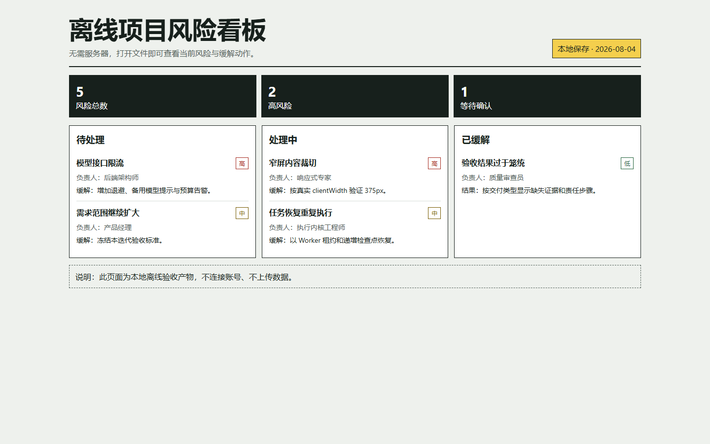
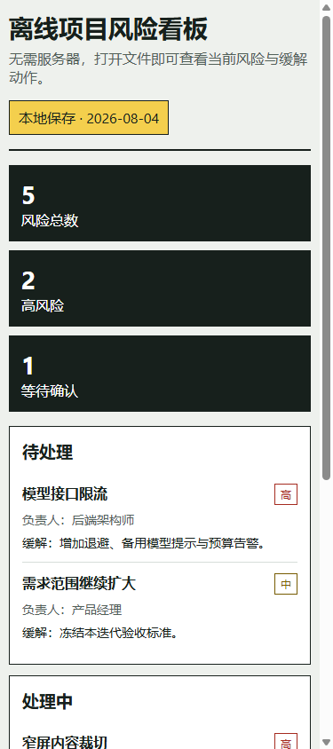

# 太极 v3.12.0 阶段报告

日期：2026-08-04

## 当前状态

源码、内置人格和本机安装版已升级到 v3.12.0 / v25，核心回归、Windows 打包和覆盖安装通过，正在完成 GitHub Release 远端验收。

## 界面与项目快照

### 太极办公室 v3.12.0

### 上一轮安装版真实项目证据

| 桌面视图 | 375px 窄屏视图 |
| --- | --- |
|  |  |

## 已完成

### DeepSeek 思考模式兼容

- 非流式响应读取并保留 `message.reasoning_content`。
- 流式响应累计并保留 `delta.reasoning_content`。
- 普通助理、员工、团队任务与 Coding Runtime 的工具调用续轮都会把 `reasoning_content` 传回模型。
- 即使 `reasoning_content` 是空字符串，也保留字段存在性，避免 DeepSeek thinking 模式续轮返回 `400 invalid_request`。

### Electron 窗口职责拆分

- `electron/windowRegistry.cjs`：统一窗口登记、替换、安全删除和快照。
- `electron/windowIpc.cjs`：窗口最小化、最大化、关闭、广播、锁定、聊天窗口、设置窗口和工具窗口 IPC 已移出 `createWindow`。
- 新增窗口新开、复用、广播、锁定与销毁专项测试。
- `createWindow` 当前最长函数约 593 行，并设置 650 行函数增长门禁。

### TaskService 职责拆分

- `electron/taskServiceIpc.cjs`：集中注册 24 个 TaskService IPC 命令并统一异常响应。
- `electron/taskServiceQueries.cjs`：指标、任务树和恢复计划。
- `electron/taskServiceContextQueries.cjs`：任务上下文、依赖就绪步骤和完成门禁。
- `electron/taskServiceEvidenceCommands.cjs`：工具尝试、产出物、引用、用量、检查点和验证证据。
- `electron/taskServiceApprovalCommands.cjs`：授权请求、批准、拒绝和补偿授权状态转换。
- `electron/taskServiceLifecycleCommands.cjs`：生命周期快照、心跳和任务状态切换。
- `taskService.cjs` 从约 676 行降至 581 行，`createTaskService` 最长函数降至 285 行。
- 新增模块与函数边界门禁，禁止上述职责回流到主文件。

### 执行语义修正

- 编码类任务即使没有显式填写仓库地址，也进入 `git-worktree` 准备态，不再误标为普通任务工作区。
- 编码类任务必须同时具备检查点和通过的验证证据，不能只凭步骤状态完成就越过完成门禁。
- 权限、鉴权和计费类不可重试错误进入 `awaiting_user`，保留任务等待用户处理；不再直接终结为失败。
- 批准普通授权后任务重新进入队列；批准补偿授权后由补偿执行器接管，避免界面显示继续但后台没有真实恢复。

## 验证结果

- Vitest：`139/139`。
- 语义基准：`400/400`。
- TypeScript/Vite 生产构建：通过。
- Lint：通过。
- DeepSeek 思考模式专项：通过。
- 窗口 IPC、TaskService IPC、上下文、审批、生命周期专项：通过。
- 原生执行、任务恢复、Skill 安装、网页读取、图片路由、Coding Runtime、诊断和可观测性：通过。
- 320 员工、12000 任务事件、40 项目与 5000 次窗口广播压力验证：通过。
- 完整 `npm.cmd run verify:v2-core-gate`：通过。

## 安装与发布资产

- 安装器：`release/taiji-office-setup-3.12.0.exe`，`195887469` 字节，SHA-256 `40AA6B9F7182C4C9EA004B4EC5E2C1674116ACD1228AEF8DA75E9A083F658275`。
- Blockmap：`206368` 字节，SHA-256 `295CB997701B24B0071B93DF5FC718272B764D2911568AC923DC988681F2B30E`。
- `latest.yml`：`356` 字节，SHA-256 `4BC5DF2787A2EA97ABE0F9A17C1B99C9F9C00EDF8CDF70898DFE22AD1BC14BC2`。
- 安装位置：`%LOCALAPPDATA%\Programs\taiji-office`；产品版本 `3.12.0.0`，`app.asar` 包内版本 `3.12.0`。
- 启动验收：启动 12 秒后进程仍存活并正常响应。
- 数据验收：覆盖前后均为 320 个文件、`477263942` 字节；备份位于 `local-backups/preinstall-3.12.0-20260804-160237`。

## 尚未完成

- `createWindow` 仍包含主窗口、伴随窗口、聊天窗口、设置窗口和工具窗口的具体构造逻辑，虽然 IPC 已拆出，构造协调仍需继续分层。
- TaskService 的任务创建、子任务继承、动态委派修复、步骤失败、自适应改计划和审查返工仍在主服务中。
- `agentLoopRuntime.ts` 的工具周期与最终收尾仍是下一批高价值拆分对象。
- Electron 真实窗口截图仍受本机 GPU 子进程退出影响；README 使用同一前端的浏览器渲染快照，并保留真实安装版项目验收图作为证据补充。
- GitHub Release 远端提交、标签、资产大小与 SHA-256 尚待发布脚本最终核对。

## 下一步

1. 拆分 TaskService 的步骤执行、审查返工和自适应恢复命令。
2. 拆分 Agent Loop 的工具调用周期与最终收尾，保持模型协议、执行控制和证据判断独立。
3. 继续拆 `createWindow` 的具体窗口构造协调，并补 Electron 实机窗口回归。
4. 完成 GitHub Release，并把远端提交、标签与三项资产核验结果写入交接记录。
