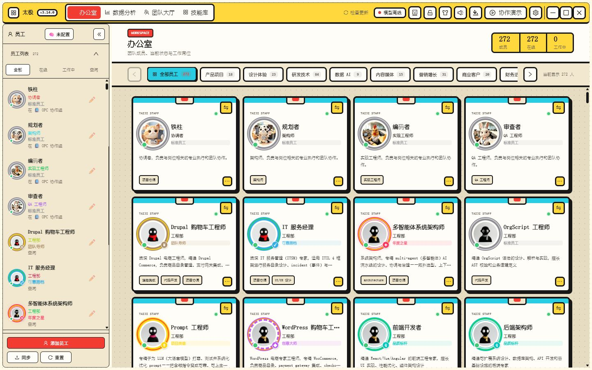
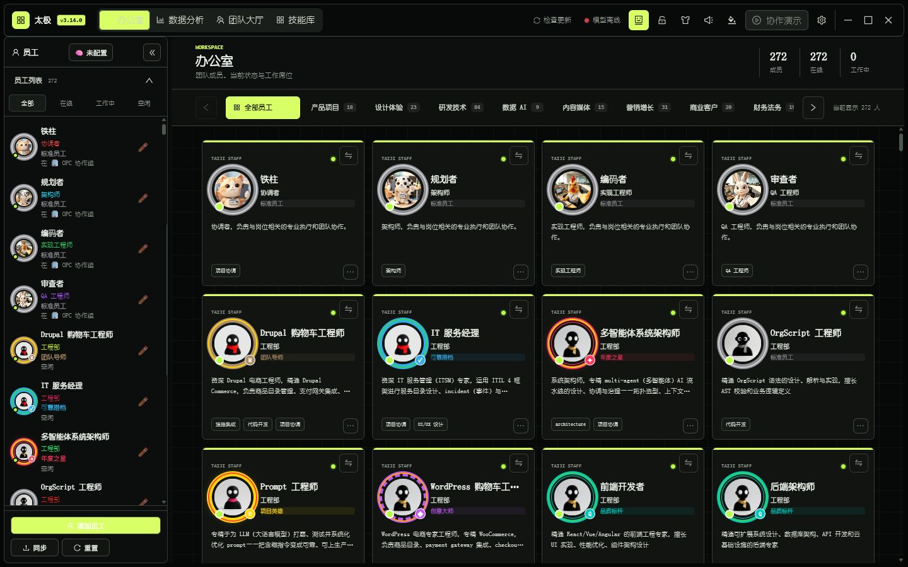
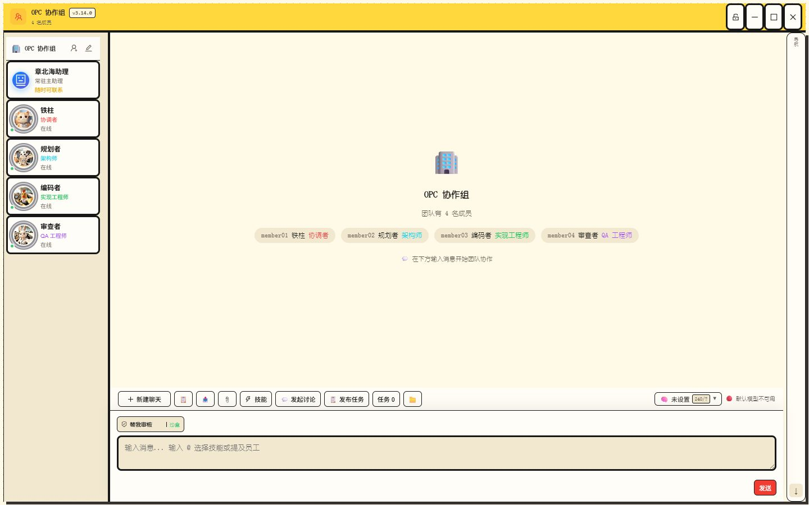

# 太极 v3.14.1 风格化生产界面

日期：2026-08-04

## 本轮定位

本轮把已由用户验收通过的风格化 HTML Demo 迁移到现有 Electron + React 生产客户端，不替换布局、数据层或任务内核。视觉系统通过根节点状态和 CSS 变量覆盖现有组件，各窗口继续复用原有业务与 IPC 协议。

## 已完成

- 原版商务：11 套配色，保留旧主题键兼容和 1px 轻量边框。
- 波普漫画：10 套配色，小点状背景、4px 主边框、3px 次级控件边框和圆润硬阴影。
- 酸性暗黑：4 套配色，深色表面、单一霓虹信号色，员工工牌不显示顶部挂带。
- 新安装默认波普漫画；每种风格独立保存上次使用的配色。
- 主窗口、员工私聊、团队窗口、设置页、任务观察栏和弹层响应同一视觉状态；跨 Electron 窗口使用广播同步。
- FC、Mac 和街机三套互动音效默认开启、音量 80%，支持关闭、调节、试听和减少动态效果偏好。

## 代码边界

- `src/data/visualSystem.ts`：风格/配色目录、迁移、存储与根节点状态。
- `src/styles/visual-system.css`：生产视觉变量和现有组件的风格投影。
- `src/data/interactionSound.ts`：Web Audio 合成音效与全局交互监听。
- `src/components/settings/InteractionSoundControl.tsx`：音效预设、开关和音量控件。
- `src/App.tsx`、`src/main.tsx`：标题栏入口、跨窗口同步与启动应用。

## 验证证据

- Vitest：`47` 个测试文件、`159/159` 通过；视觉目录单测验证三种风格、25 套配色、默认值、独立记忆和对比模式。
- `verify:visual-system` 验证风格入口、4px/3px 层级、酸性工牌规则、跨窗口同步与 80% 默认音量。
- TypeScript/Vite 生产构建、Lint 与仓库卫生门禁通过。
- 快照目录：`docs/snapshots/v3.14.1-visual-system/`。

| 波普办公室 | 酸性暗黑办公室 | 波普团队窗口 |
| --- | --- | --- |
|  |  |  |

## 后续边界

`v3.14.1` 是 UI 产品化版本，不把视觉迁移描述为智能体内核升级。下一阶段严格进入 `v3.15`：长任务驻留、跨重启恢复、目标/计划/证据一致性和通用产出物语义验收。
